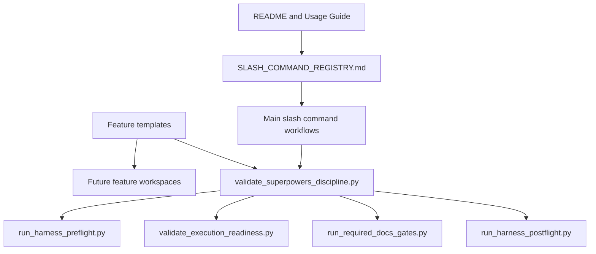

# Implementation Plan: Superpowers Discipline Layer V34

> Feature ID: `020-superpowers-discipline-layer-v34`
> Spec: `spec.md`
> Constitution: `.agents/memory/constitution.md`

## 1. Technical Summary

V34 adds a first-class Superpowers discipline contract to Marcus Fleet without
vendoring Superpowers or changing Marcus Fleet's canonical spec topology. The
implementation adds a marker-based validator, wires it into existing harness
gates, updates templates for future workspaces, and adds discipline sections to
the slash-command workflows published in README. The validator is intentionally
simple and deterministic: it checks local files for required behavioral markers
and reports exact drift.

## 2. Constitution Gates

- [x] Specification has no unresolved clarification markers.
- [x] Contracts are defined before implementation through this plan, data model,
      routing file, and validator behavior.
- [x] Verification method is named before implementation.
- [x] No shell `eval` or unbounded command execution is introduced.
- [x] No hardcoded production secret is introduced.
- [x] TypeScript changes are not part of this feature.
- [x] Rollback path is documented for command-surface changes.

### Superpowers V34 Discipline Gates

- [x] Clarification-first: operator chose deep integration and README-published
      command coverage.
- [x] No placeholders: executable sections identify files, markers, and gates.
- [x] TDD path: validator smoke checks run before closeout; behavior is local
      file validation with deterministic failure messages.
- [x] Root cause path: the upgrade addresses the specific gap that command
      workflows lacked an enforced discipline contract.
- [x] Review order: spec compliance review is documented before code quality
      review.
- [x] Evidence-before-claim: final status requires fresh validator output.

## 3. Architecture

### 3.1 Current State

- Existing command surface is documented in `README.md`, `USAGE_GUIDE.md`, and
  `SLASH_COMMAND_REGISTRY.md`.
- Existing gates validate specs, command surface, skill contracts, context
  index, docs substance, and routing regression.
- Workflows already contain many governance rules but no single validator proves
  Superpowers-style discipline is still present across every public command.

### 3.2 Target State

- New script `scripts/validate_superpowers_discipline.py` validates workflow and
  template discipline markers.
- `run_required_docs_gates.py`, `run_harness_preflight.py`,
  `run_harness_postflight.py`, and `validate_execution_readiness.py` call the
  new validator.
- Public docs and registry mention the V34 discipline gate.
- Templates generate future feature packages with clarification ledger,
  planning discipline, TDD task rules, and verification-before-claim rules.

### 3.3 Mermaid Diagram

## 4. Contracts

| Contract | Purpose | Producer | Consumer |
| --- | --- | --- | --- |
| `validate_superpowers_discipline.py` marker map | Defines required V34 markers per workflow/template/feature file. | `.agents/scripts` | preflight, postflight, docs gates, routecheck |
| Workflow discipline sections | Make expected agent behavior visible in each slash command. | workflow files | human operators and agents |
| Template discipline sections | Seed new specs with clarification, TDD, review, and evidence rules. | templates | `create_feature_spec.py` and future specs |
| Public command docs | Tell operators which gates are official. | README, usage guide, registry | command surface validator and users |

Compatibility is checked with `validate_command_surface.py`,
`validate_superpowers_discipline.py`, and feature-specific readiness gates.

## 5. Data Model

The only new data model is the validator's marker contract:

- Workflow marker: relative file path plus required phrases.
- Template marker: relative template path plus required phrases.
- Feature marker: generated feature file plus required phrases when a feature is
  validated for execution readiness.
- Validation result: pass/fail plus exact missing file or marker.

No persistent database schema, TrustGraph schema, or MCP data contract changes
are introduced.

## 6. Agent Routing

| Workstream | Primary Agent | Output | Verification |
| --- | --- | --- | --- |
| Validator implementation | `alan-tech-lead` | `scripts/validate_superpowers_discipline.py` | validator pass/fail smoke |
| Workflow discipline | `marcus-ai-orchestrator` | `workflows/*.md` sections | discipline validator |
| Template upgrade | `sophia-product-manager` and `ada-qa-agent` | updated templates | generated feature marker checks |
| Public docs and registry | `marcus-docs-writer` | README, usage guide, registry | command surface validation |
| Gate wiring | `alan-tech-lead` | harness scripts and readiness script | preflight/postflight/docs gate commands |

Execution monitoring:

- Blocking gates before implementation: spec validation and discipline validator
  design review.
- Evidence checkpoints: validator root pass, command surface pass, feature
  marker pass.
- Escalation condition: if validator blocks valid wording, update marker map
  rather than bypassing the gate.

## 7. Migration and Rollback

- Migration steps: add validator, wire scripts, update workflows/templates/docs,
  regenerate or patch the active v34 feature workspace, and run validators.
- Rollback steps: remove validator calls from harness scripts, remove routecheck
  registry reference, and delete the V34 workflow/template sections.
- Compatibility notes: old feature workspaces may require reconciliation before
  execution readiness under V34.
- Blast radius: `.agents` governance files only.
- Containment strategy: no application source code or external services are
  modified.

## 8. Complexity Tracking

| Decision | Reason | Alternative Rejected | Review Needed |
| --- | --- | --- | --- |
| Marker-based validator | Fast, deterministic, easy to wire into existing gates. | AST or natural-language validator would be slower and less predictable. | Revisit only if marker drift causes false failures. |
| Deep integration into existing commands | Operator requested README-published command coverage. | Hidden bridge skill would not enforce behavior. | Routecheck after future command changes. |
| No vendored Superpowers repo | Avoids duplicate source of truth and update burden. | Copying upstream skills directly would conflict with Marcus skill contracts. | Reconsider only if plugin packaging becomes a requirement. |

## 9. POC Slice and Review Cadence

- POC slice boundary: validator plus wiring into harness scripts and routecheck,
  with workflow/template marker coverage for public commands.
- Success evidence for the slice: `validate_superpowers_discipline.py --root .`
  passes and `validate_command_surface.py --root .` passes.
- What remains intentionally unproven after the slice: full execution of every
  slash command in a live downstream project.
- Review cadence:
  - Draft architecture review: confirm validator covers all public commands.
  - Challenge review: confirm integration does not create a second source of
    truth.
  - Verification readiness review: run discipline and command-surface gates.
- Stop conditions: validator blocks on missing markers, command surface drifts,
  or readiness script cannot call the new validator.
- Proceed conditions: validators pass and residual risk is documented.
